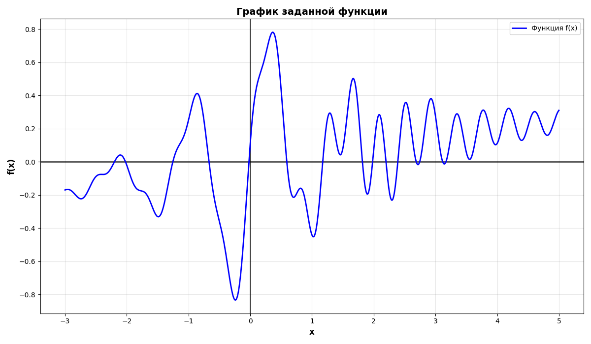
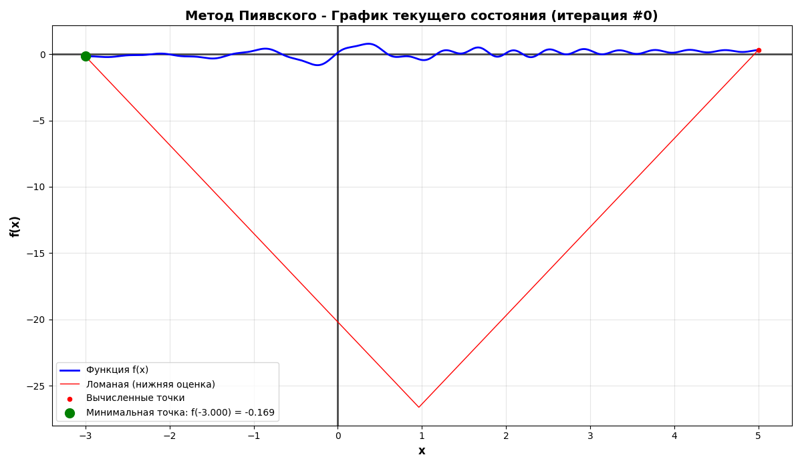
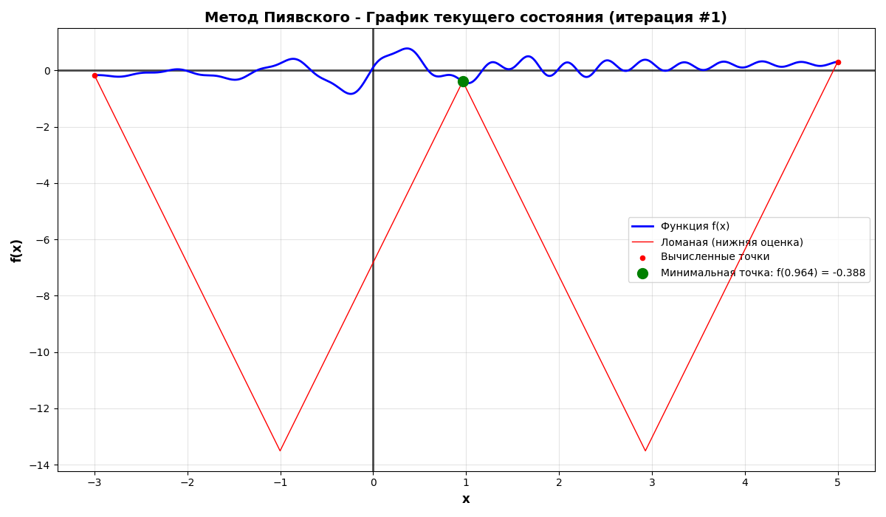
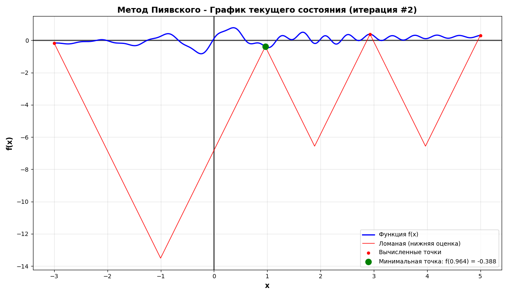
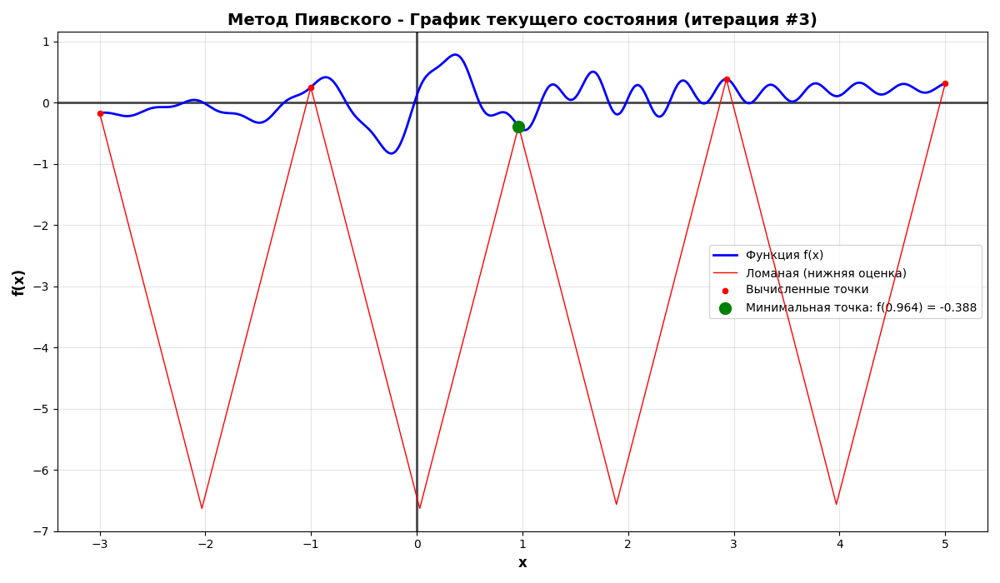
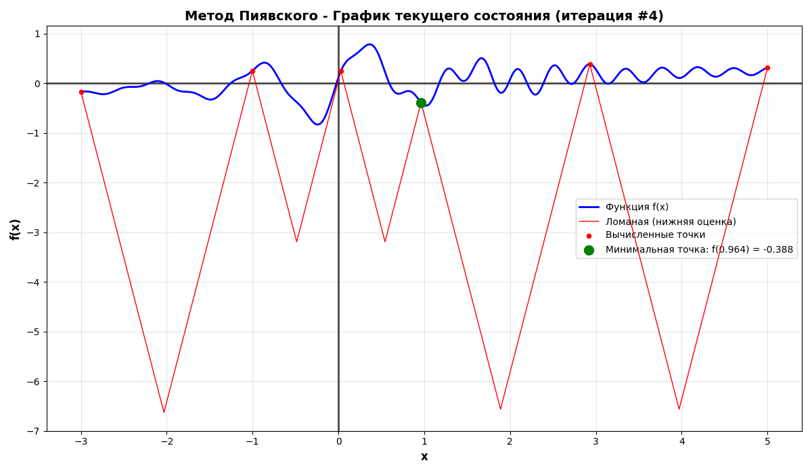
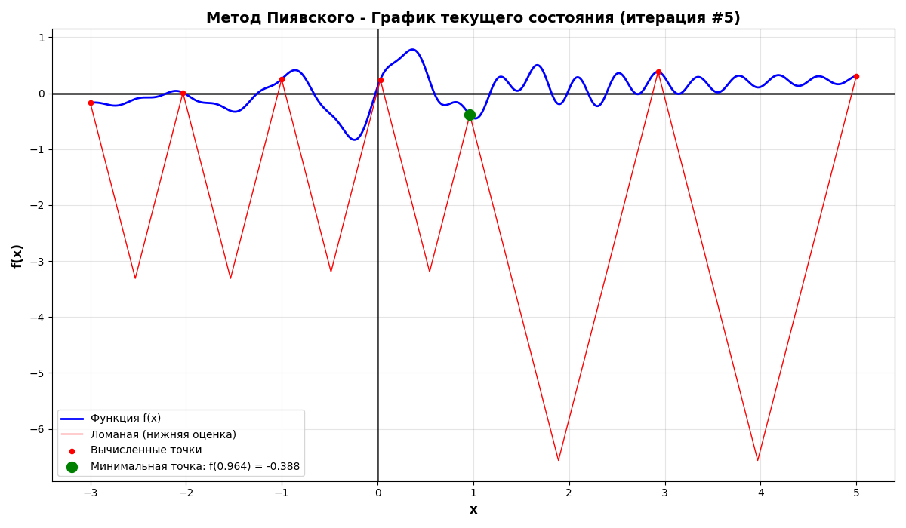
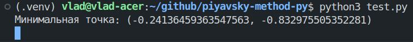
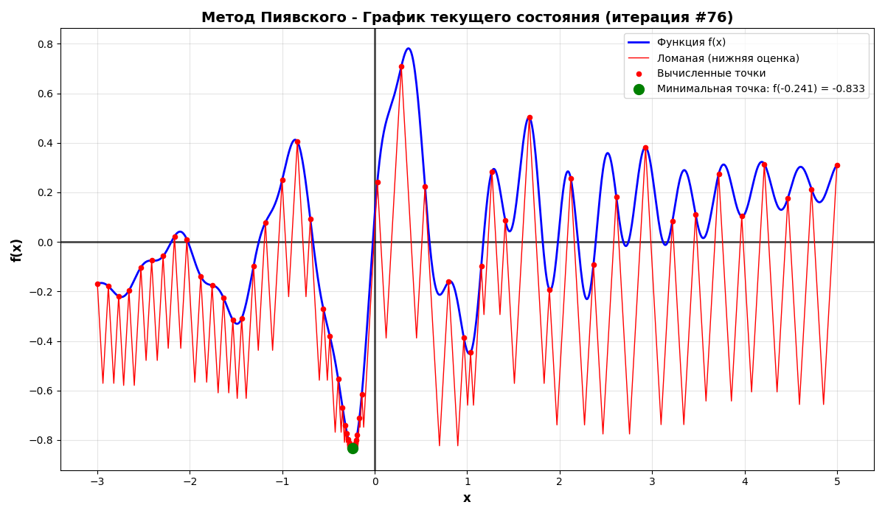

# Задание №2. Метод ломаных

## Ф.И.О.

Клименков Владислав Максимович

## Поток

МЕТОПТ 1.2

## Краткое описание механизма работы программы

Программа принимает на вход липшецевую функцию $F(x)$, границы исследуемого отрезка $x_{start}$ и $x_{end}$, а также минимальную требуемую точность вычислений $eps$. Далее программа с помощью метода Пиявского находит и возвращает точку минимума заданной функции на заданном отрезке: $(x_{min}, F(x_{min}))$.

### Описание реализации метода Пиявского в программе

После получения липшицевой функции $F(x)$ и границ исследуемого отрезка $x_{start}$ и $x_{end}$, программа создаёт массив точек на функции, изначально включив в него только точки $x_{start}$ и $x_{end}$. На основе точек из массива строится ломаная (нижняя огибающая оценка), путём проведения из каждой точки двух прямых с наклонами $\pm L$ (где $L$ - приблизительно рассчитанная константа Липшеца). В результате между каждыми двумя соседствующими на графике функции точками образуется точка пересечения, расположенная под графиком функции (т.к. функция является липшицевой и не может опускаться быстрее, чем прямая с наклоном $L$). Далее из всех точек пересечения выбирается самая минимальная, берётся её координата $x_{new}$ и на график функции добавляется новая точка с этой координатой $x_{new}$, т.е. в результате на графике функции появляется новая точка $(x_{new},F(x_{new}))$. Далее строится новая ломанная с учётом новой добавленной точки и т.д. Процесс продолжается до тех пор, пока разница между минимальной точкой на графике функции и минимальной точкой пересечения не станет меньше заданного значения точности $eps$, т.е. $F(x_{min})-y_{new}<eps$. После этого точка $(x_{min}, F(x_{min}))$ возвращается как минимум функции $F(x)$ в рамках погрешности $eps$.

### Построение графиков

Также программа даёт возможность построить два вида графиков:

- График только с заданной функцией, ограниченной заданным отрезком.
- График заданной функции, ограниченной заданным отрезком, с отмеченными на нём точками и построенной ломанной, соответствующим текущей стадии решения. При этом отдельно выделяется текущая минимальная точка на графике функции. 

## Инструкция по работе с программой

Весь код программы содержится в файле `piyavsky_method.py`. Программа реализована в виде класса `PiyavskyMethod`, который при инициализации принимает параметры:

- `func` - строка с липшицевой функцией,
- `x_start` - координата $x$ начала рассматриваемого отрезка,
- `x_end` - координата $x$ конца рассматриваемого отрезка,
- `eps` - требуемая точность решения.

Вот пример инициализации класса:

```python
pm = PiyavskyMethod("f(x)=x+math.sin(math.pi*x)", -5, 5, 0.01)
```

> Заметим, что для ввода формулы используется синтаксис Python, а значит для математических операторов, которые не доступны в Python по-умолчанию, требуется добавлять приставку `math.`, чтобы использовать модуль `math`.

Далее созданный экземпляр класса имеет следующие методы:

```python
# Вывести график заданной функции без решения
pm.plot(show_solution=False)

# Сделать один шаг решения по методу Пиявского
pm.step()  # -> True - если в рамках шага достигнута заданная точность, False - если нет

# Полностью решить задачу методом Пиявского с заданной точностью
pm.solve()  # -> Кортеж с координатами минимальной точки: (<x_min>, <F(x_min)>)

# Вывести график заданной функции с текущим состоянием решения
pm.plot()
```

## Демонстрация работы программы

Для демонстрации работы программы я попросил ИИ сгенерировать сложную липшицевую функцию и в результате получил следующие условия задачи:

```python
func = "f(x)=math.sin(5*x)*math.exp(-abs(x))+0.3*math.cos(15*x)*math.exp(-0.5*abs(x-2))+0.05*x"
x_start = -3
x_end = 5
eps = 0.01
```

Давайте создадим файл `test.py`, импортируем `PiyavskyMethod` и инициализируем его:

```python
# test.py

from piyavsky_method import PiyavskyMethod

# Условия задачи
func = "f(x)=math.sin(5*x)*math.exp(-abs(x))+0.3*math.cos(15*x)*math.exp(-0.5*abs(x-2))+0.05*x"
x_start = -3
x_end = 5
eps = 0.01

# Создаём экземпляр класса, передавая ему условия задачи
pm = PiyavskyMethod(func, x_start, x_end, eps)
```

Перед решением задачи выведем заданный график без решения:

```python
# Выводим график заданной функции без решения
pm.plot(show_solution=False)
```

При выполнении кода получаем следующий график:



Теперь попробуем вывести график функции с текущим состоянием решения:

```python
pm.plot()
```


Видим, что раз мы пока не делали ни одного шага решения, то ломанная строится лишь по двум точкам - границам отрезка. Соответственно, минимальной точкой также указана одна из границ отрезка.

Теперь попробуем вручную сделать несколько шагов решения с помощью метода `.step()` и отобразить график с состоянием решения для каждого шага:

```python
for _ in range(6):
    pm.plot()
    pm.step()
```













Чтобы вручную не перебирать все шаги, воспользуемся методом `.solve()`, который самостоятельно сделает необходимое число шагов, чтобы найти минимальную точку с заданной точностью:

```python
min_point = pm.solve()
print(f"Минимальная точка: ({min_point[0]}, {min_point[1]})")
pm.plot()
```




В результате мы получили и численный, и визуальный результат решения задачи, а также число затраченных итераций (в нашем случае решение заняло 76 итераций).

## Вывод

В рамках данной работы мне удалось создать программу, позволяющую находить минимум заданной липшицевой функции на заданном отрезке с помощью метода Пиявского. При этом, созданная программа предоставляет результаты решения как в числовом (координаты минимальной точки), так и в визуальном (график заданной функции с визуальным отображением решения) форматах.
